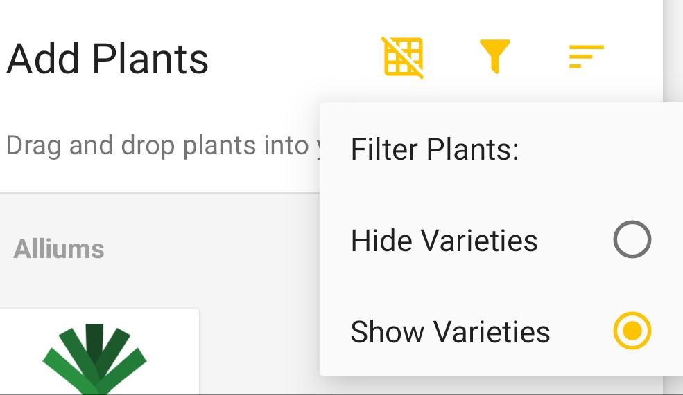
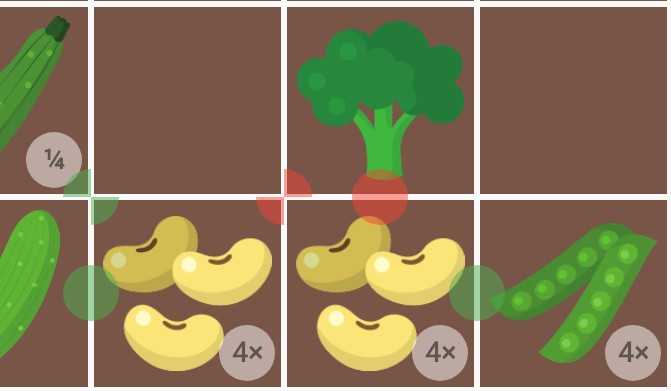

# Planter FAQ

### How do I create a garden?

View this [video tutorial](https://youtu.be/wOKNkJqbt8A)

### How do I create a custom plant?

View this [video tutorial](https://youtu.be/ox65gthSCDM)

### How do I add a variety of a plant?

View this [video tutorial](https://youtu.be/r_NDs-RGTuU)

### I don't see sweet potatoes, green onions, or red peppers? Where are they?

Click the "filter" icon and select "Show Varieties" to see all plants.

### Why doesn't Planter have {name of plant}?

I try my best to add more plants, but it is a time consuming task. This is not my full-time job and I have 2 kids under 2, so as you can imagine it's hard to find the time. Thanks for your understanding 😉. You can always add a custom plant, just see the tutorials linked above.

### What do those green and red circles mean?

Green circles mean the adjacent plants are companions and work well together.

Red circles mean the adjacent plants are combative and shouldn't be planted.

### What do those circles with 4× and ¼ mean?

4× indicates you can plant 4 plants in that square.

¼ indicates you need 1 plant per 4 squares. __Why doesn't the plant just take up 4 squares?__ Well, when I first started Planter, that was the intention. However, it's a challenging technical problem that I haven't been able to solve _yet_. In the meantime, I just leave 3 empty squares around a large plant like Tomatoes. Other gardeners fill in all 4 squares. It's up to you.

